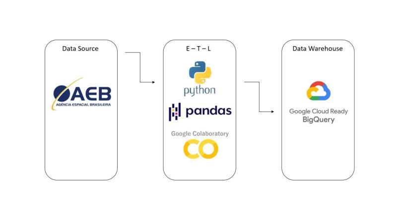

## ETL Com Python

Projeto: Desenvolvimento de um Pipeline de ETL (Extract, Transform and Load) utilizando linguagem Python.

## Etapas de Desenvolvimento

1. Extração de dados no formato .csv
    - Importação de arquivos com pandas
    - Navegação pelos dados

2. Limpeza, transformação e enriquecimento de dados
    - Merge (Joins entre tabelas)
    - Remoção de colunas
    - Renomeação de colunas
    - Criação de novas colunas
    - Correção de registros incorretos (Replace)
    - Modificação dos tipos de dados
    - Tratamento de registros nulos
   
3. Carregamento desses dados em uma instância do Google Big Query
    - Conectando no Google Big Query
    - Carregando os dados no Data Warehouse

## Protótipo do Pipeline

## Passo a Passo

Utilizando o Google Colab, extraí três tabelas com dados no formato .csv utiliando a Biblioteca Pandas.
Em seguida, prossegui com as etapas de Limpeza, Transformação e Enriquecimento dos dados utilizando a mesma Biblioteca (Pandas).
Finalmente, após ter criando uma única tabela, carreguei os dados em uma instância do Google Big Query utilizando a biblioteca Google Auth.

## Geração de Valor para o Negócio

#### Qualidade dos Dados:
O processo de limpeza, transformação e enriquecimento dos dados garante que as informações sejam consistentes, corretas e confiáveis.

#### Tomada de Decisão Baseada em Dados:
Um projeto de ETL bem-sucedido fornece dados preparados e prontos para análise, isso permite que a empresa tome decisões baseadas em dados.

#### Previsibilidade e Planejamento:
Com dados consistentes e bem-organizados, é possível fazer previsões mais precisas, avaliar cenários e planejar estratégias de longo prazo.

#### Eficiência Operacional:
Automatizar o processo de ETL reduz a necessidade de trabalho manual e repetitivo, economizando tempo e esforço da equipe, permitindo a criação de relatórios, painéis e análises de forma mais rápida e eficiente, demonstrando uma resposta ágil às mudanças do mercado.

#### Redução de Erros:
A automação do processo de ETL reduz a probabilidade de erros humanos que podem ocorrer durante atividades manuais de extração, transformação e carregamento de dados.

#### Escalabilidade:
Utilizando uma estrutura robusta, o projeto pode lidar com grandes volumes de dados e crescer conforme as necessidades do negócio.

#### Consolidação de Dados:
A união de múltiplas fontes de dados em um único local, facilita a exploração dos dados, análises avançadas, aprendizado de máquina e inteligência artificial, para identificar padrões complexos e insights que impulsionam a inovação.

## Sobre o Desenvolvedor

Lucas Ramalho atua como Senior Data Analyst e Analytics Engineer, é formado em Big Data e Inteligência Competitiva, atua com dados desde 2021 e já atuou em diferentes segmentos como Varejo, Logística, Indústria e Tecnologia.

Atua no desenvolvimento de soluções em dados para apoiar a tomada de decisão e melhorar o desempenho dos negócios ao utilizar os dados de forma eficiente e estratégica.

Possui forte experiência em Manipulação de dados, Pipelines de ETL/ELT, Modelagem de dados, Qualidade de dados, Documentação Técnica e Visualização de dados.

Conheça mais detalhes no [LinkedIn](https://www.linkedin.com/in/olucasramalho/).

Fique a vontade para se conectar nas redes sociais:

 
  
  
  

